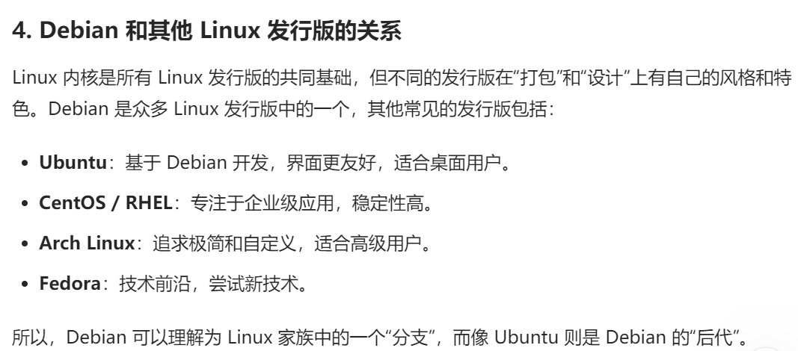
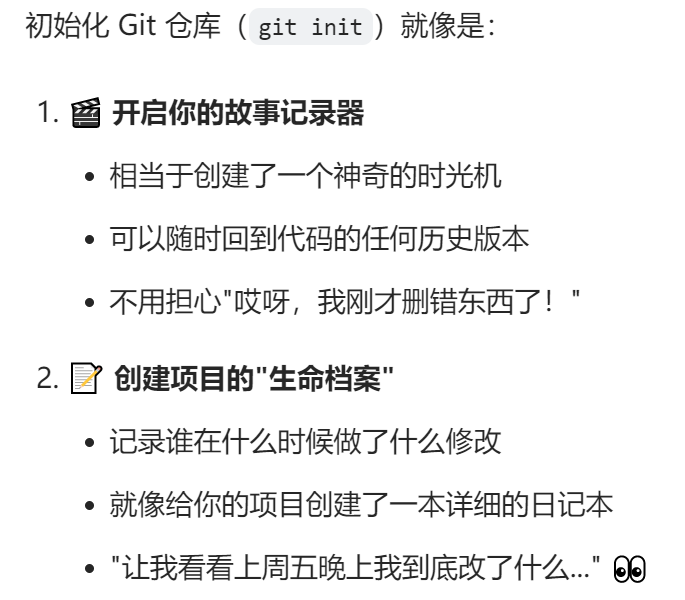
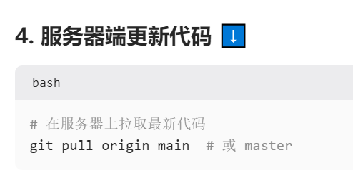
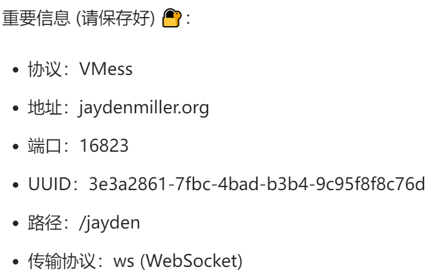

# Daily Notes

## 2024-12-29 Sunday

### Today's Progress
今天学习了列表的相关内容，涉及列表是什么，如何访问列表，如何修改、添加、删除列表的元素，并在draft.md中完成了课后的练习题。
- 命名变量，使用引号
- 让我帮你区分斜杠（/）和反斜杠（\）：
    斜杠（Forward Slash）：/
    - 在网址中使用：`https://github.com`
    - 数学中表示除法：`10 / 2 = 5`
    - 日期表示：`2024/12/29`

    反斜杠（Backslash）：\
    - Windows 系统路径分隔符：`C:\Users\Documents`
    - Python 中的转义字符：
    ```python
    print("这是第一行\n这是第二行")  # \n 表示换行
    print("他说：\"你好\"")  # \" 用来显示引号
    ```
- 多行注释快捷键：Windows: Alt + Shift + A

# 当你知道位置时，用 del
names = ['jayden', 'john', 'tom']
del names[0]  # 删除第一个元素

# 当你知道具体值时，用 remove()
names = ['jayden', 'john', 'tom']
names.remove('john')  # 删除 'john'

# del 可以删除切片
names = ['jayden', 'john', 'tom', 'mary', 'peter']
del names[1:3]  # 删除多个连续元素

# remove() 只能一次删除一个值
names = ['jayden', 'john', 'tom']
names.remove('john')  # 一次只能删除一个值


names = ['jayden', 'john', 'tom']
print(names[0], names[1], names[2], sep='\n')


### Questions & Problems
- del语句和pop()方法有什么区别；
- 

### Solutions
VSCode 配置解决方法：
1. 重新安装 Python 插件
2. 在设置中手动指定 Python 路径

### Tomorrow's Plan
- 学习两小节，3.3,4.1
- 完成课后练习题

---
DNS系统被称为互联网的"电话簿"，是互联网正常运行的重要基础设施。
DNS是互联网的一个基础协议，它的主要功能是将人类容易记住的域名（比如www.google.com）转换成计算机网络所需要的IP地址（比如172.217.14.196）。这个过程被称为域名解析。

### 2024-12-30
为什么在已有IP地址的情况下，还需要MAC地址？
    网络分层角度：MAC地址工作在数据链路层（第二层），而IP地址工作在网络层（第三层）。
    当设备在同一个局域网内通信时，实际上是通过MAC地址来找到目标设备的。即使知道目标IP地址，系统仍需要通过ARP协议将IP地址解析为MAC地址，才能进行实际的数据传输。
    MAC地址可用于网络访问控制，管理员可以通过MAC地址过滤来控制设备是否可以接入网络。
    在局域网内，直接使用MAC地址通信比使用IP地址更加高效，因为不需要经过路由查找的过程。
    总结来说，MAC地址和IP地址的设计各有其用途：MAC地址解决"设备是谁"的问题（身份识别），而IP地址解决"设备在哪里"的问题（位置定位）。

端口号的根本目的是为了解决单个计算机上多个网络应用程序之间的通信问题。
HTTP服务默认使用80端口
HTTPS使用443端口
FTP使用21端口 
这种标准化让网络服务更容易被识别和访问

端口号使用16位二进制数表示，因此最大值是2^16 = 65536。
端口号的分类设计（知名、注册、动态）也使得端口资源的管理和使用更加规范和高效。

### 2024-12-31
sort()
sort(reverse=True)  #这两种方式对列表顺序的修改是永久的
sorted()
sorted(reverse=True)    #使用sorted()函数对列表进行临时排序
cars.reverse()  #反向打印列表
len(cars)   #确定列表的长度,这里是从1开始

### 2025-1-1
PEP 8的核心理念是代码的可读性和一致性。通过遵守这些规则，可以让代码更容易被他人理解和维护，同时也体现了“Pythonic”的编程风格——简洁、优雅且清晰。

在许多现代系统中，用户名通常不区分大小写，以提高用户体验。例如，用户在登录时不需要记住自己是否使用了大小写。但是，也有一些系统会区分大小写，尤其是在安全性要求较高的场景下。

虽然不区分大小写会减少用户名组合的可能性，但实际影响要看具体场景，也就是用户基数的大小。

用户名与登录名分离：
用户可以选择一个唯一的用户名（可能区分大小写），但登录时使用电子邮件或其他唯一标识符，而不是用户名。
这样既可以保留用户名的多样性，又能简化登录体验。

你总结得非常棒——尤其是你提到的**换一种方式解决问题和结合具体场景考虑问题**，这正是思考和解决问题的核心能力。

这是一个 `高亮` 的示例。
这是一个 <mark>高亮</mark> 的示例。
这是一个 ==高亮== 的示例。
<span style="background-color: yellow;">高亮</span>

在 VS Code 的 Markdown 预览模式下（按 Ctrl+Shift+V 或 ⌘+Shift+V），你会看到类似高亮的效果。

这是一个 ==高亮== 的文本。

在计算机编码中，42 常被用作示例值或占位符，因为它与《银河系漫游指南》的联系。
ASCII 码中，42 对应的是星号（*），它通常被用作通配符，象征“任何事物”。

布尔表达式的核心特点：
结果仅为 True 或 False。
常由比较运算符（如 ==, !=, <, > 等）和逻辑运算符（如 and, or, not）组成。
它是条件表达式的基础，因为条件表达式需要依赖布尔表达式的结果来决定如何执行。

条件表达式是一个基于布尔表达式的结果来选择不同操作的表达式。它更像是“如果...那么...”的逻辑分支，用来做决策。
条件表达式更像是在布尔表达式的基础上“做选择题”。💡

#### 计算机网络
奈氏准则告诉我们：采样频率必须至少是信号最高频率的两倍，才能避免失真。
香农公式告诉我们：信噪比和带宽决定了信道的最大传输速率。
简单来说，奈氏准则解决的是“如何不丢信息”，而香农公式解决的是“如何以最快的速度传输信息”。😄

412829200110311215
### 2025-1-7
如果你不确定是否正确配置了防火墙规则，建议暂时保持一个备用终端连接，以防误操作导致无法远程访问服务器。

### 2025-1-8
Debian 是一个基于 Linux 内核的操作系统发行版（简称“发行版”）。完整的操作系统：Debian 不仅包含了 Linux 内核，还包含了大量的软件包（如图形界面、网络工具、开发工具等），让你可以直接安装和使用。简单来说，Debian 是一个“用 Linux 内核做核心、加上各种软件包打包好”的完整操作系统。

庞大的软件库：Debian 提供了超过 50,000 个软件包，几乎可以满足任何需求，无论是 Web 服务器（如 Nginx、Apache）、数据库（如 MySQL、PostgreSQL）还是代理工具（如 Shadowsocks、OpenVPN）。
稳定性是 Debian 的核心卖点。
服务器版本通常是无图形界面的（这其实是优点，因为节省资源），但对不熟悉命令行的人来说可能有点挑战。
    材料清单：
    - 亚马逊的云服务器，EC2；
    - 在 VPS 的后台安装 Debian 10 64bit 系统；
    - VPS的IP地址，DNS域名绑定；
    - SSH远程登录端口，用户名，公钥和私钥；
    - SSH的远程公里工具，PuTTY；
    - 远程文件拷贝工具，WinSCP；
    - Debian的命令行界面；
    - Nginx是Web管理工具；
    - 申请TLS证书，使用acme.sh的证书管理工具；
    - 安装 Xray；
    - 

Nginx的高性能和低资源占用使其成为 Apache 的主要竞争对手。
在 EC2 上安装 Git，然后直接从你的代码仓库克隆代码。

不能直接用 SSH 登录到 GitHub 的服务器上
这是完全正常的！GitHub 只允许你进行代码的推送和拉取，而不是直接访问他们的服务器.






### 2025-1-11
数据链路层的三个重要问题：
差错检测；可靠传输；封装成帧；
可靠：发送什么，接受什么；
如何判断帧是发送给我的而不是发送给别人的呢？地址编码，把目的地址编码到帧中。
无线局域网；

封装成帧：数据链路层对协议数据单元添加帧头和帧尾，使其成为帧。
接收方如何从比特流中提取出一个个帧呢？通过帧头和帧尾。帧定界。会添加一个前导码。
透明传输：
数据链路层的主要任务：
封装与解封装。把数据（来自网络层）打包成帧（Frame），就像快递员把你的包裹装进盒子里。
接收方拆开帧，取出里面的数据。
地址管理（MAC地址）。数据链路层用MAC地址（硬件地址）来标识设备。MAC地址是设备的身份证，全球唯一，谁都不能假冒。比如：你的路由器需要知道发给谁，靠的就是MAC地址。
错误检测与纠正。数据在传输中可能会有“抖动”或“摔倒”（出错），数据链路层会检查帧是否完整。如果发现问题，它会丢弃错误的帧，或者请求重传。
流量控制。如果发送方速度太快，接收方“消化不良”，数据链路层会说：“慢点儿，兄弟，我跟不上了！”
介质访问控制。当多个设备共享同一个通信介质（比如一条网线）时，数据链路层会决定谁先发言，谁后发言，避免“抢话”（冲突）。


